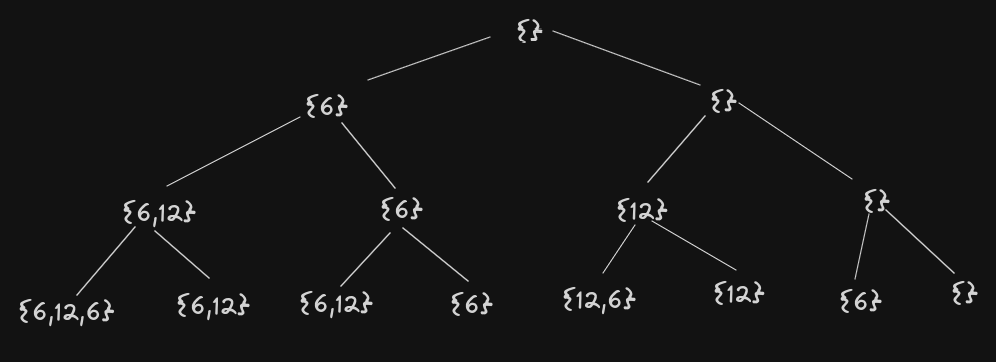

SumaSubconjuntosBT
---

En este ejercicio vamos a resolver el problema de suma de subconjuntos con la técnica de backtracking.\
Dado un multiconjunto $C = {c_1,...,c_n}$ de números naturales y un natural $k$, queremos determinar si existe un subconjunto de C cuya sumatoria sea $k$.\
Vamos a suponer fuertemente que $C$ está  ordenado de alguna forma arbitraria pero  conocida (i.e., $C$ está implementado como la secuencia $c1,...,c_n$ o, análogamente, tenemos un iterador de $C$).\
Las $\textcolor{purple}{soluciones \ (candidatas)}$ son los vectores $a = (a_1,...,a_n)$ de valores binarios; el subconjunto $P$
de $C$ representado por $a$ contiene a $c_i$ si y sólo si $a_i = 1$. Luego, $a$ es una $\textcolor{purple}{solucion \ válida}$ cuando $\sum_{i=1}^{n} a_i c_i = k$.\
Asimismo, una $\textcolor{purple}{solución \ parcial}$ es un vector $p = (a_1,...,a_i)$ de números binarios con $0 ≤ i ≤ n$.\
Si $i < n$, las $\textcolor{purple}{soluciones \ sucesoras}$  de $p$ son $p ⊕ 0$ y $p ⊕ 1$, donde $⊕$ indica la concatenación.

---
**a)** Escribir el conjunto de $\textcolor{purple}{soluciones \ (candidatas)}$ para $C = \{6,12,6\}$ y $k = 12$.

Las $\textcolor{purple}{soluciones \ (candidatas)}$ son los vectores $a = (a_1,...,a_n)$ de valores binarios; el subconjunto $P$
de $C$ representado por $a$ contiene a $c_i$ si y sólo si $a_i = 1$.

$a_1=\{0, 0, 0\}$\
$a_2=\{1, 0, 0\}$\
$a_3=\{0, 1, 0\}$\
$a_4=\{0, 0, 1\}$\
$a_5=\{1, 1, 0\}$\
$a_6=\{0, 1, 1\}$\
$a_7=\{1, 0, 1\}$\
$a_8=\{1, 1, 1\}$

---

**b)** Escribir el conjunto de $\textcolor{purple}{soluciones \ válidas}$ para $C = {6,12,6}$ y $k = 12$.

$a$ es una $\textcolor{purple}{solucion \ válida}$ cuando $\sum_{i=1}^{n} a_i c_i = k$.

$a_3=\{0, 1, 0\}$\
$a_7=\{1, 0, 1\}$\

---

**c)** Escribir el conjunto de $\textcolor{purple}{soluciones \ parciales}$ para $C = {6,12,6}$ y $k = 12$.

Una $\textcolor{purple}{solución \ parcial}$ es un vector $p = (a_1,...,a_i)$ de números binarios con $0 ≤ i ≤ n$.

$p=(0, 0, 0)$\
$p=(0, 1, 0)$\
$p=(1, 0, 0)$

---

**d)** Dibujar el $\textcolor{purple}{árbol \ de \ backtracking}$ correspondiente al algoritmo descrito arriba para $C = \{6,12,6\}$ y $k = 12$, indicando claramente la relación entre las distintas componentes del árbol y los conjuntos de los incisos anteriores.




---

**e)** Sea $C$ la familia de todos los multiconjuntos de números naturales. Considerar la siguiente función recursiva $ss : C × N → {V, F }$ (donde $N = {0, 1, 2, . . . }$, $V$ indica verdadero y $F$ falso):

$$ ss(\{c_1,...,c_n\}, k) =  \begin{cases} k==0 & \text{si } n = 0 \\ ss(\{c_1, . . . , c_{n−1}\}, k) ∨ ss(\{c_1 , . . . , c_{n−1} \}, k − c_n ) & \text{si } n > 0 \end{cases}$$

Convencerse de que $ss(C, k) = V$ si y sólo si el problema de subconjuntos tiene una solución
válida para la entrada $C$, $k$.\
Para ello, observar que hay dos posibilidades para una solución
válida $a = (a_1,...,a_n)$ para el caso $n > 0$ : o bien $a_n = 0$ o bien $a_n = 1$.\
En el primer caso, existe un subconjunto de ${c_1,...,c_{n−1}}$ que suma $k$; en el segundo, existe un subconjunto de ${c_1,...,c_{n−1}}$ que suma $k − c_n$.

---

**f)** Convencerse de que la siguiente es una implementación recursiva de $ss$ en un lenguaje
imperativo y de que retorna la solución para $C, k$ cuando se llama con $C, |C|, k$.\
¿Cuál es su complejidad?

```
1) subset_sum(C, i, j : // implementa ss({c_1,...,c_i }, j)
2)  Si i = 0, retornar (j = 0)
3)  Si no, retornar subset_sum(C, i−1, j) ∨ subset_sum(C, i−1, j−C[i])
```
En peor caso la función explora todos los subconjuntos posibles de C por lo que su complejidad es exponencial.

---

**g)** Dibujar el árbol de $\textcolor{purple}{llamadas \ recursivas}$ para la entrada $C = {6, 12, 6}$ y $k = 12$, y compararlo con el árbol de *$\textcolor{purple}{backtracking}$*.


---

*h)* Considerar la siguiente regla de factibilidad : $p = (a_1 , . . . , a_i)$ se puede extender a una solución válida sólo si $\sum_{q=1}^{i}{a_q c_q} \leq k$.\
Convencerse de que la siguiente implementación incluye la regla de factibilidad.
```
1) subset_sum(C, i, j): // implementa ss({c_1,...,c_i }, j)
2) Si j < 0, retornar falso // regla de factibilidad
3) Si i = 0, retornar (j = 0)
4) Si no, retornar subset_sum(C, i−1, j) ∨ subset_sum(C, i−1, j−C[i])
```

---

**i)** Definir otra *regla de factibilidad*, mostrando que la misma es correcta; no es necesario implementarla.

Si sumando todo lo que podamos sumar en el conjunto, no llegamos a j entonces cortamos la búsqueda. 

---

**j)** Modificar la implementación para imprimir el subconjunto de $C$ que suma $k$, si existe.\
Ayuda: mantenga un vector con la solución parcial $p$ al que se le agregan y sacan los
elementos en cada llamada recursiva; tenga en cuenta de no suponer que este vector se
copia en cada llamada recursiva, porque cambia la complejidad.

```
1) subset_sum(C, i, j, partial_solution): // implementa ss({c_1,...,c_i }, j)
2)  if j < 0
        return false // regla de factibilidad
3)  if i = 0 and (j=0)
        print solucion_parcial
        return true
4)  else 
        return subset_sum(C, i−1, j, solucion_parcial) 
        ∨  subset_sum(C, i−1, j−C[i], partial_solution ++ [C[i]])
```
