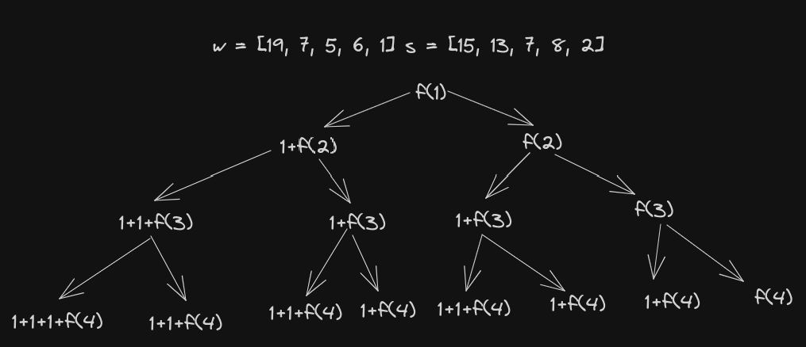

PilaCauta
---

Tenemos cajas numeradas de $1$ a $N$ , todas de iguales dimensiones. 

Queremos encontrar la máxima cantidad de cajas que pueden apilarse en una única pila cumpliendo que:

* sólo puede haber una caja apoyada directamente sobre otra;
* las cajas de la pila deben estar ordenadas crecientemente por número, de abajo para arriba;
* cada caja $i$ tiene un peso $w_i$ y un soporte $s_i$, y el peso total de las cajas que están arriba de otra no debe exceder el soporte de esa otra.

Si tenemos los pesos $w = [19, 7, 5, 6, 1]$ y los soportes $s = [15, 13, 7, 8, 2]$ (la caja $1$ tiene peso $19$ y soporte $15$, la caja $2$ tiene peso $7$ y soporte $13$, etc.), entonces la respuesta es $4$. 

Por ejemplo, pueden apilarse de la forma $1-2-3-5$ o $1-2-4-5$ (donde la izquierda es más abajo), entre otras
opciones.

#### a) Pensar la idea de un algoritmo de backtracking (no hace falta escribirlo).

La idea sería ir probando todas las posibles combinaciones de cajas que se pueden apilar, y quedarse con la que tenga mayor cantidad de cajas. Para esto, se recorre el vector de cajas y se prueban los casos en donde se apila la caja y se llama recursivamente a la función con la siguiente caja y no se apila y se llama recursivamente a la función con la siguiente caja sin apilar la caja actual.

#### b) Escribir una formulación recursiva que sea la base de un algoritmo de PD. Explicar su semántica e indicar cuáles serían los parámetros para resolver el problema.

```math
pila\_cauta(i, s, w, s\_sol) =
    \begin{cases}
        0 & \text{si } i = |w| \\
        1 + pila\_cauta(i+1, s, w, s\_sol=\forall j\lt |s\_sol|, \ s\_sol[j] - w\_sol[i] \geq 0) & \text{si } \forall j\lt |s\_sol|, \ s\_sol[j] - w\_sol[i] \geq 0 \\
        pila\_cauta(i+1, s, w, s\_sol) & \text{si no se puede apilar la caja i}
    \end{cases}
```

#### c) Diseñar un algoritmo de PD y dar su complejidad temporal y espacial auxiliar. Comparar cómo resultaría un enfoque top-down con uno bottom-up.

```c++
int pila_cauta(int i, vector<int> &s, vector<int> &w, vector<int> & memo, vector<int> & s_sol) {
    if (memo[i] != -1) return memo[i];
    if (i == w.size()) return 0;
    bool puedo_apilar = true;
    for (int c : s_sol) {
        if (c - w[i] < 0) puedo_apilar = false;
    }
    if (puedo_apilar) {
        //considero apilar la caja y no apilarla
        for (int j = 0; j < s_sol.size(); j++) {
            s_sol[j] -= w[i];
        }
        int apilo = 1 + pila_cauta(i+1, s, w, memo, s_sol);
        for (int j = 0; j < s_sol.size(); j++) {
            s_sol[j] += w[i];
        }
        int no_apilo = pila_cauta(i+1, s, w, memo, s_sol);
        memo[i] = max(apilo, no_apilo);
        return memo[i];
    } else {
        //no apilo
        memo[i] = pila_cauta(i+1, s, w, memo, s_sol);
        return memo[i];
    }
```

La complejidad temporal del algoritmo es $O(N*N)$ con $N$ la cantidad de cajas.

La complejidad espacial es $O(N)$ 

---



Si lo resolvieramos con un enfoque bottom-up deberíamos ir resolviendo los casos "desde las hojas". 

En la imagen se muestra cómo se irían resolviendo los llamados a la función `pila_cauta` con un enfoque top-down. En cada llamado se resuelven los llamados a la derecha antes de resolver los llamados a la izquierda. 

En un enfoque $\textcolor{pink}{bottom-up}$ se resolverían primero los llamados de las hojas antes de resolver los llamados de arriba. En este caso, se resolverían primero los llamados a la caja 4, luego los llamados a la caja 3, luego los llamados a la caja 2, etc.
