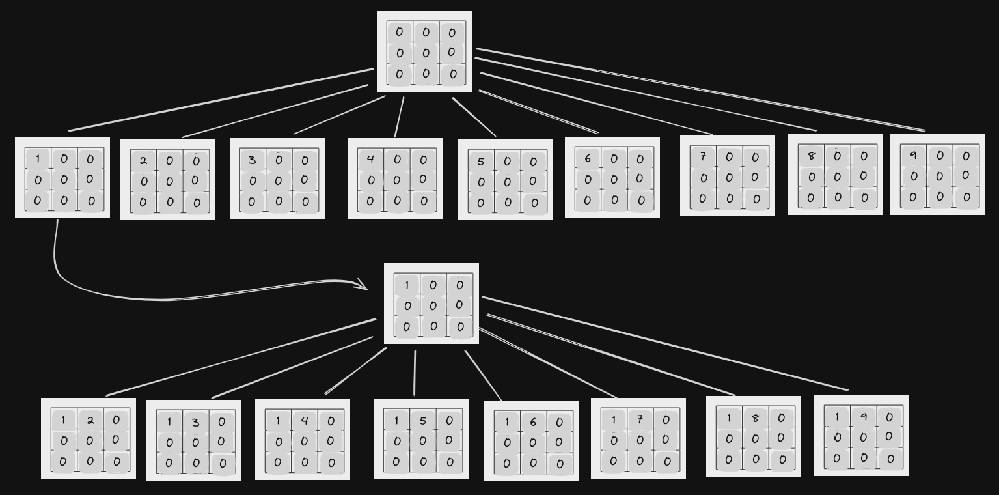

MagiCuadrados
---

Un *cuadrado mágico de orden* $n$, es un cuadrado con los números $\{1,...,n^2\}$, tal que todas sus filas, columnas y las dos diagonales suman lo mismo.\
El número que suma cada fila es llamado *número mágico*.\
El objetivo de este ejercicio es contar cuántos cuadrados mágicos de orden $n$ existen.

---

**a)** ¿Cuántos cuadrados habría que generar para encontrar todos los cuadrados mágicos si se
utiliza una solución de $\textcolor{purple}{fuerza \ bruta}$?

Habría que generar $n²!$ cuadrados, ya que tenemos $n²$ números para permutar.

---

**b)** Enunciar un algoritmo que use **backtracking** para resolver este problema que se base en las siguientes ideas:

* La **solución parcial** tiene los valores de las primeras $i−1$ filas establecidos, al igual que los valores de las primeras $j$ columnas de la fila $i$.
* Para establecer el valor de la posición $(i, j+1)$ (o $(i+1, 1)$ si $j = n$ e $i \neq n$) se consideran todos los valores que aún no se encuentran en el cuadrado.

* Para cada valor posible, se establece dicho valor en la posición y se cuentan todos los cuadrados mágicos con esta nueva solución parcial.

El algoritmo debe devolver la cantidad de cuadrados mágicos de orden $n$.

```C++
int res = 0;
void magic_squares(vector<int>& used, int i, int j, vector<int>& square){
    if (i == n and j == n and is_magic_square(square)) res++;   //res accumulates the number of magic squares

    if(j == n and i < n){
        for(int k = 1; k <= n*n; k++){
            if (used[k] == 0){      //to not repeat numbers in the square
                square[i][j] = k;
                used[k] = 1;
                magic_square(used, i+1, 0, square);
                magic_square[i][j] = 0;
            }
        }
    }

    if(j < n){
        for(int k = 1; k <= n*n; k++){
            if(used[k] == 0){
                square[i][j] = k;
                used[k] = 1;
                magic_square(used, i,j+1, square);
                magic_square[i][j] = 0;
            }
        }
    }
}
```

```C++
bool is_magic_square(vector<int> square){
    int sum = int sum = accumulate(square[0].begin(), square[0].end(), 0);
    for(int i = 1; i < square.size(); i++){
        int row_sum = accumulate(square[i].begin(), square[i].end(), 0);
        if(row_sum != sum) return false;
    }
    int column_sum = 0;
    for(int i = 0; i < square[0].size(); i++){
        col_sum = 0;
        for(int j=0; j < square.size(); j++){
            col_sum += square[i][j]; 
        }
        if(col_sum != sum) return false;
    }
    int diagonal1_sum = 0;
    int diagonal2_sum = 0;
    for(int i = 0; i < square[0].size(); i++){
        for(int j=0; j < square.size(); j++){
            if(i == j) diagonal1_sum += square[i][j];
            if(i = square[0].size()-1-j) diagonal2_sum += square[i][j];
        }
    }
    if(diagonal1_sum != sum) return false;
    if(diagonal2_sum != sum) return false;
    return true;
}

```

*Mostrar los primeros dos niveles del árbol de backtracking para `n = 3`.*



---

**c)** Demostrar que el árbol de backtracking tiene $O(n^2)!$ nodos en peor caso.

El árbol de backtracking en el primer nivel ubica $n²$ números posibles en la primera posición de tablero.\
En el segundo nivel, para cada uno de esos posibles tableros ($n²$) ubica ($n²-1$ (menos el que ya uso en cada caso)) números por lo que en total ubica $n²*(n-1)$ números en el segundo nivel.\
En el tercer nivel para cada uno de esos $n²*(n²-1)$ tableros ubica en cada uno $n²*(n²-1)*(n²-2)$ números en cada tablero.\
 Y así continúa hasta que sólo tiene ún número (el de la última posición) para ubicar por lo que solo tiene un tablero.\
Por lo tanto si en el primer nivel tiene $n²$ nodos, en el segundo $n²*(n²-1)$, en el tercero $n²*(n²-1)*(n²-2)$ ... podemos formular que tiene:$\prod_{k=0}^{n^2-1} (n^2 - k)$
nodos que es exactamente el factorial y esta productoria tiene $O(n^2)!$ nodos en peor caso.

---

**d)** Considere la siguiente poda al árbol de backtracking: al momento de elegir el valor de una nueva posición,
* Verificar que la suma parcial de la fila no supere el número mágico. 
* Verificar también que la suma parcial de los valores de las columnas no supere el número mágico.

Introducir estas podas al algoritmo e implementarlo en la computadora. ¿Puede mejorar estas podas?

```C++
int res = 0;
void magic_squares(vector<int>& used, int i, int j, vector<int>& square){
    if (i == n and j == n and is_magic_square(square)) res++;   

    if(i>0){
        int magic_number = accumulate(square[0].begin, square[0].end, 0);
    }

    //SUMA DE FILAS Y COLUMNAS
    int row_sum = accumulate(square[i].begin, square[i].end);
    int col_sum = 0;
    for(int r=0; r<=i; r++){
        col_sum += square[r][j];
    }
    if(j == n and i < n){
        for(int k = 1; k <= n*n; k++){
            if (used[k] == 0){      
                // PODA
                if(i>0 and row_sum+k <= magic_number and col_sum+k <= magic_number){
                    square[i][j] = k;
                    used[k] = 1;
                    magic_square(used, i+1, 0, square);
                    magic_square[i][j] = 0;
                }
                if(i==0){
                    square[i][j] = k;
                    used[k] = 1;
                    magic_square(used, i+1, 0, square);
                    magic_square[i][j] = 0;
                }
            }
        }
    }

    if(j < n){
        for(int k = 1; k <= n*n; k++){
            if(used[k] == 0){
                //PODA
                if(i>0 and row_sum+k <= magic_number and col_sum+k <= magic_number){
                    square[i][j] = k;
                    used[k] = 1;
                    magic_square(used, i,j+1, square);
                    magic_square[i][j] = 0;
                }
                if(i==0){
                    square[i][j] = k;
                    used[k] = 1;
                    magic_square(used, i+1, 0, square);
                    magic_square[i][j] = 0;
                }
            }
        }
    }
}
```

---

e) Demostrar que el número mágico de un cuadrado mágico de orden $n$ es siempre $(n^3 + n) \div 2$.\
Adaptar la poda del algoritmo del ítem anterior para que tenga en cuenta esta nueva información.\
Modificar la implementación y comparar los tiempos obtenidos para calcular la cantidad de cuadrados mágicos.

Si existe un cuadrado mágico $M$ de orden $n$, la suma de **todas las filas** del mismo equivale a la suma de todos sus elementos, siendo estos los números de $1$ a $n^2$, entonces:

$\begin{align}\nonumber \sum_{i=1}^n \sum_{j=1}^n M_{ij} = \sum_{k=1}^{n^2} k = \frac{n^2\cdot(n^2 + 1)}{2} \end{align}$

Dado que cualquier fila $k$, $1≤k≤n$, debe sumar lo mismo que cualquier otra fila $j$, $1≤j≤n$, podemos concluir que:

$\begin{align}\nonumber \sum_{j=1}^n M_{kj} = \frac{1}{n} \cdot \frac{n^2\cdot(n^2 + 1)}{2} = \frac{(n^3 + n)}{2} \end{align}$
