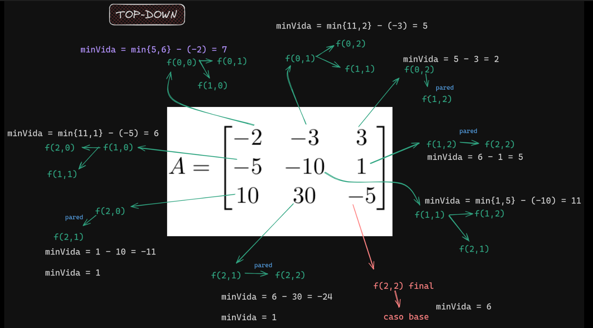
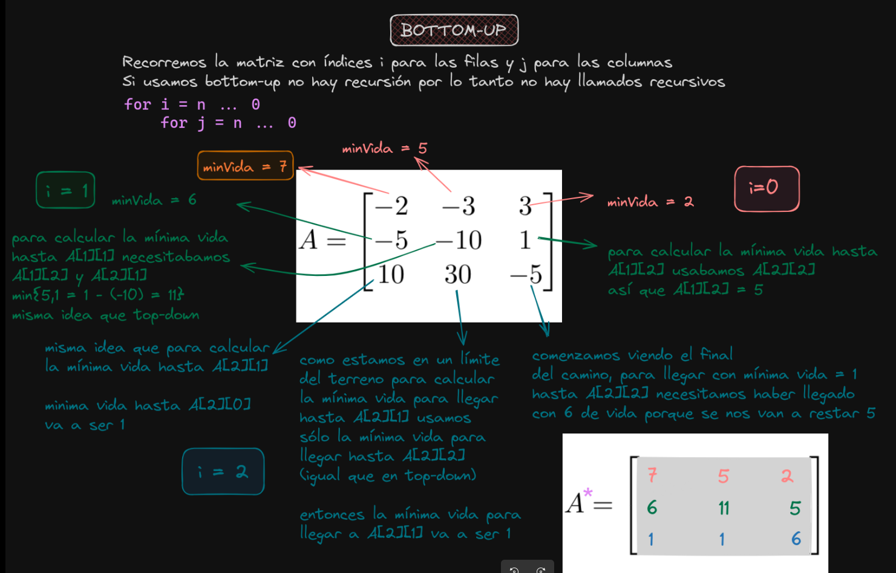

Travesía Vital
---
Hay un terreno, que podemos pensarlo como una grilla de $m$ filas y $n$ columnas, con trampas y pociones.

Queremos llegar `de la esquina superior izquierda hasta la inferior derecha`, y desde cada casilla sólo podemos movernos a la casilla de la $derecha$ o a la de $abajo$. 

Cada casilla $i,j$ tiene un número entero $A_{i,j}$ que nos modificará el nivel de vida sumándonos el número $A_{i,j}$ (si es $negativo$, nos va a restar $|A_{i,j}|$ de vida). 

Queremos saber el $\textcolor{pink}{mínimo\ nivel\ de\ vida}$ con el que debemos comenzar tal que haya un camino posible de modo que en todo momento nuestro nivel
de vida sea al menos $1$.

#### a) Pensar la idea de un algoritmo de backtracking (no hace falta escribirlo).

Idea: en cada desición debo considerar cuánto de vida necesito para moverme a la siguiente casilla.

```C++
//vida actual siempre tiene que ser al menos 1
int min_vida(int i, int j, int vida_actual){
    //caso base: si estoy en la última casilla, necesito de vida al menos lo que me cueste llegar a la última casilla
    if(i == m - 1 && j == n - 1){
        if(A[i][j] + vida_actual < 1){
            return vida_actual = vida_actual + abs(A[i][j] + vida_actual);
        }
    else{
        return vida_actual;
    }
    //si no estoy en la última casilla, tengo que ver cuánto de vida necesito para moverme a la siguiente casilla
    if(i < m - 1 && j == n - 1){    //si estoy en la última columna pero no en la última fila, cambio de fila
        if(A[i][j] + vida_actual < 1) return vida_actual = vida_actual + abs(A[i][j] + vida_actual) + min_vida(i + 1, 0, vida_actual);
        else return vida_actual = min_vida(i + 1, 0, vida_actual);
    }
    if(j < n - 1 && i == m - 1){    //si estoy en la última fila pero no en la última columna, cambio solo de columna
        if(A[i][j] + vida_actual < 1) return vida actual = vida actual + abs(A[i][j] + vida_actual) + min_vida(i, j + 1, vida_actual);
        else return vida actual = min_vida(i, j + 1, vida_actual);
    }
    if(i < m - 1 && j < n - 1){
        if(A[i][j] + vida_actual < 1) return vida actual = vida_actual + abs(A[i][j] + vida_actual) + min(min_vida(i + 1, j, vida_actual), min_vida(i, j + 1, vida_actual));
        else return vida actual = min(min_vida(i + 1, j, vida_actual), min_vida(i, j + 1, vida_actual));
    }
}
```

#### b) Convencerse de que excepto que estemos en los límites del terreno, la mínima vida necesaria al llegar a la posición $i,j$ es el resultado de restar al mínimo entre la mínima vida necesaria en $i+1,j$ y aquella en $i,j+1$, el valor $A_{i,j}$ , salvo que eso fuera menor o igual que 0, en cuyo caso sería $1$.

#### c) Escribir una formulación recursiva basada en b). Explicar su semántica e indicar cuáles serían los parámetros para resolver el problema.

```math
min\_vida(i, j) = \begin{cases} 
max( min(min\_vida(i+1, j), min\_vida(i, j+1)) - A[i][j], 1) & \text{si } i < m-1 \text{ y } j < n-1 \\
 \end{cases}
```

#### d) Diseñar un algoritmo de PD y dar su complejidad temporal y espacial auxiliar. Comparar cómo resultaría un enfoque top-down con uno bottom-up.

En un enfoque $\textcolor{pink}{top-down}$, se calcula la mínima vida necesaria para llegar a la posición $i,j$ a partir de las mínimas vidas necesarias para llegar a las posiciones $i+1,j$ y $i,j+1 $. En un enfoque $\textcolor{pink}{bottom-up}$, se calcula la mínima vida necesaria para llegar a la posición $i,j$ a partir de las mínimas vidas necesarias para llegar a las posiciones $i-1,j$ y $i,j-1$.

```C++
const int INF = 1e9;

int min_vida(int i, int j, vector<vector<int>>& A, vector<vector<int>>& memo){
    if(memo[i][j] != INF) return memo[i][j];
    if(i == m-1 && j == n-1) memo[i][j] = max(1, 1 - A[i][j]);
    if(i < m-1 && j == n-1) memo[i][j] = max(1, min_vida(i+1, j, A, memo) - A[i][j]);
    if(j < n-1 && i == m-1) memo[i][j] = max(1, min_vida(i, j+1, A, memo) - A[i][j]);
    if(i < m-1 && j < n-1) memo[i][j] = max(1, min(min_vida(i+1, j, A, memo), min_vida(i, j+1, A, memo)) - A[i][j]);
    return memo[i][j];
}   
```

Complejidad temporal: $O(m*n)$.

Complejidad espacial auxiliar: $O(m*n)$.



#### e) Dar un algoritmo bottom-up cuya complejidad temporal sea $O(m*n)$ y la espacial auxiliar sea $O(min(m,n))$.

```C++
int min_vida(){
    vector<vector<int>> memo(m, vector<int>(n, INF));
    memo[m-1][n-1] = max(1, 1 - A[m-1][n-1]);
    for(int i = m-1; i >= 0; i--){
        for(int j = n-1; j >= 0; j--){
            if(i == m-1 && j == n-1) memo[i][j] = max(1, 1 - A[i][j]);
            if(i < m-1 && j == n-1) memo[i][j] = max(1, memo[i][j] - A[i][j]);
            if(j < n-1 && i == m-1) memo[i][j] = max(1, memo[i][j+1] - A[i][j]);
            if(i < m-1 && j < n-1) memo[i][j] = max(1, min(memo[i][j], memo[i][j+1]) - A[i][j]);
        }
    }
    return memo[0][0];
}
```

```C++
int min_vida(){
    vector<int> memo(min(m, n), INF);
    memo[memo.size()-1] = max(1, 1 - A[m-1][n-1]);
    for(int i = m-1; i >= 0; i--){
        for(int j = n-1; j >= 0; j--){
            if(i == m-1 && j == n-1) memo[j] = max(1, 1 - A[i][j]);
            if(i < m-1 && j == n-1) memo[j] = max(1, memo[j] - A[i][j]);
            if(j < n-1 && i == m-1) memo[j] = max(1, memo[j+1] - A[i][j]);
            if(i < m-1 && j < n-1) memo[j] = max(1, min(memo[j], memo[j+1]) - A[i][j]);
        }
    }
    return memo[0];
}
```

Complejidad temporal: $O(m*n) $.

Complejidad espacial auxiliar: $O(min(m,n))$.

