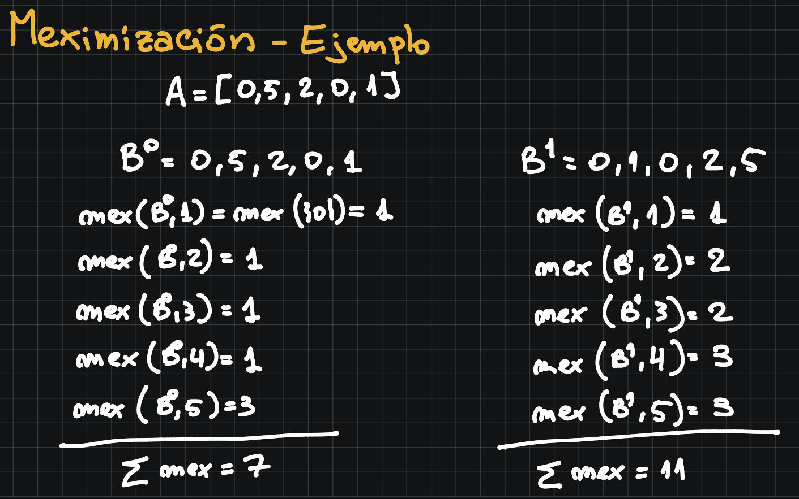
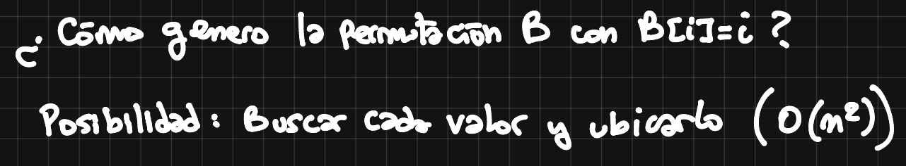
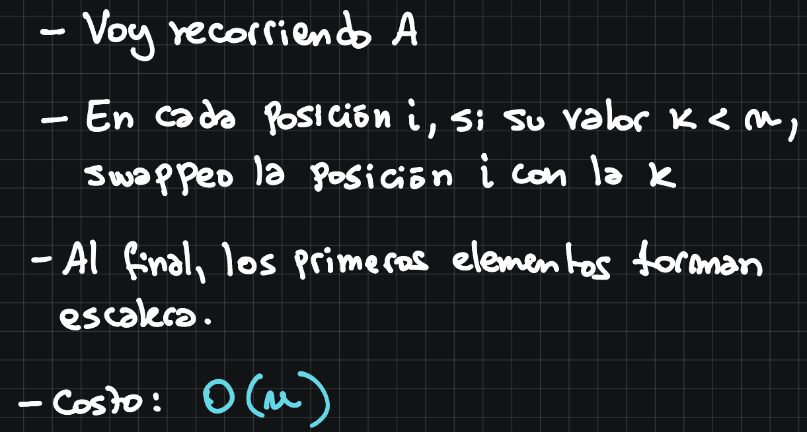

### <u>MaxMex</u>

---

*Se define la función $mex : P(N) → N$ como:\
$mex(X) = mı́n \{ j : j ∈ N ∧ j \notin X\}$*\
*Intuitivamente, mex devuelve, dado un conjunto X, el menor número natural que no está en x.\
Por ejemplo, $mex(\{ 0, 1, 2 \}) = 3$, $mex({0, 1, 3}) = 2$ y $mex({1, 2, 3, . . .}) = 0$.*

---

*Dado un vector de números $a_1 . . . a_n $ queremos encontrar la permutación $b_1 . . . b_n $ de los mismos
que maximize $\sum_{i=1}^{n} mex(\{ b_1, . . . , b_i \}) $*

---

*Por ejemplo, si el vector es {3, 0, 1} podemos ver que la mejor permutación es {0, 1, 3}, que alcanza un valor de: $mex({0}) + mex({0, 1}) + mex({0, 1, 3}) = 1 + 2 + 2 = 5 .$*

*a) Proponer un algoritmo greedy que resuelva el problema y demostrar su correctitud.\
<u>Ayuda</u>: ¿Cuál el máximo valor que puede tomar mex(X) si X tiene n elementos? Rta: n.\
Si X ⊆ Y , ¿Qué pasa con los valores mex(X) y mex(Y)?\
Si $X \subseteq Y $ entonces $mex(X) \leq mex(Y) $.*

---

Notar que si $mex(X, i)=k$, entonces $k \leq i $ porque $X $ a lo sumo es una permutación del conjunto $\{0, 1, 2, ..., i-1\} $.

Además, para $j \geq i $, $mex(X, j) \geq k $, porque el valor más grande posible es el primer faltante, todos los elementos que ya estaban seguirán estando.

---

**<u>Permutación óptima:</u>**

Buscamos que $mex(B^*, i)$ sea máximo $\forall i$.\
Para el primer elemento vamos a querer el 0, si no está, $\sum mex $ va a dar siempre 0.\
Asimismo, en la segunda posición vamos a querer tener el uno, en la tercera el 2, ...

---

<u>**Solución greedy** </u>

Definimos que una solución del problema es <u>*greedy*</u> si cumple que tiene el valor $i$ en la $i$-ésima posición (de ser posible).\
Por otra parte, es <u>*óptima*</u> si maximiza $\sum_{i=1}^n mex(B,i)$ para toda permutación B.

---

<u>**greedy $\rarr$ óptima:**</u>\
Sea $A = a_1, ... a_n $ input, $G = g_1, ..., g_n $ permutación greedy, e $Y = y_1, ..., y_n $ una permutación cualquiera.\
Veamos que $P(k) \equiv $ Si $k \leq n $, entonces $\sum_{i=1}^k mex(G, i) \geq \sum_{i=1}^k mex(Y,i) $.

---

Hacemos inducción.

---

$P(0) \rarr $ Trivial

---

$P(k) \rarr P(k+1) $\
Si $k+1 > n $, la implicación falsea el precedente y por lo tanto vale.\
Sea $k \leq n $, vemos que $m = mex(G, k+1) \geq mex(Y, k+1) $, \
Si $m = k+1 $, esto vale porque $k+1 $ es el máximo valor posible para $mex(Z, k+1) $ (el mínimo que no está no puede ser mayor).

Si $m \leq k $, entonces $0, 1, ..., m-1 $ están en $g_1, ..., g_{k+1} pero m no está.\
Luego, $m $ no está en $G $ y por ende no está en $A $ ni en $Y $, porque por ser $G $ greedy, no puede estar después.\
Por lo tanto, $mex(Y, i) =min\{y \in N : y \notin Y \} \leq m = mex(G, k+1) \forall i $, en particular para $i = k $, así que $mex(G, k+1) \geq mex(Y, k+1) $.\
Lo que sigue, es inducción, 

$\sum_{i=1}^{k+1} mex(G,i) = \sum_{i=1}^{k} mex(G,i) + mex(G, k+1) \geq \sum_{i=1}^{k} mex(G,i) + mex(Y, k+1)$

Por `HI`

$\geq \sum_{i=1}^{k} mex(Y,i) + mex(Y, k+1) = \sum_{i=1}^{k+1} mex(Y,i) $

Por lo tanto, la permutación greedy es óptima.

---

*b) Dar una implementación del algoritmo del inciso anterior con complejidad temporal O(n).*

Otra posibilidad con mejor costo:

