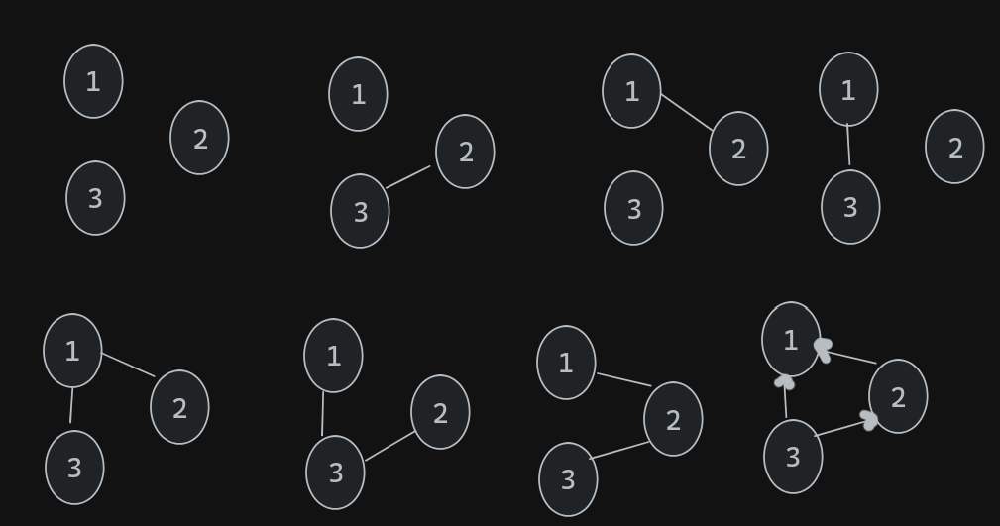

### Unicidad Digrafo

*Un grafo orientado es un digrafo D tal que al menos uno de v → w y w → v no es una arista de D, para todo v, w ∈ V (D).\
En otras palabras, un grafo orientado se obtiene a partir
de un grafo no orientado dando una dirección a cada arista.\
Demostrar en forma constructiva que **para cada n existe un único grafo orientado cuyos vértices tienen todos grados de salida distintos**.\
Ayuda: aprovechar el ejercicio anterior y observar que el absurdo no se produce para un único
grafo orientado.*

---

Queremos demostrar que dado un grafo de n vértices, para cada n (es decir, para cada tamaño del grafo) existe un único grafo orientado cuyos vértices tienen todos grados de salida distintos.

---
<u>Demo:</u>\
Dado un grafo de n=1 vértices, el grafo no orientado es el mismo grafo orientado, ya que no hay aristas para dirigir.

---

Dado un grafo de n=2 vértices, el grafo orientado es único, ya que sólo puede haber una única arista para dirigir y por lo tanto el grado de salida de el primer nodo va a ser 1 y el de salida de el segundo va a ser 0 así que tienen todos grados de salida distintos.

---

Dado un grafo de n=3 vértices, el grafo orientado es el mismo que el grafo no orientado, pero con las aristas dirigidas hacia algún otro nodo.

Por el ejercicio anterior sabemos que todo grafo no trivial tiene al menos dos vértices del mismo grado.\
Sabemos que cada vértice puede tener desde grado 1 hasta grado (n-1) o desde grado 0 hasta grado (n-2).

---

Cuando el grafo es orientado cada vértice puede tener grado de salida (n-1) - su grado de entrada.

---

Para que todos los grados de salida de cada vértice sean distintos, podemos asignar un grado de salida único a cada vértice si: 
* el primer vértice puede tener 0 aristas de salida (todas las aristas que lo involucran son entrantes), 
* el segundo vértice puede tener 1 arista de salida (y (n-2) entrantes), 
* y así sucesivamente hasta el último vértice, que tendría (n-1) aristas de salida y 0 entrantes.

---

Es así como construimos un grafo orientado asegurando que cada vértice tenga un grado de salida distinto.

---

#### <u>Abs:</u>
Si hubieran dos grafos orientados distintos $o$ y $o'$ con todos sus vértices con grados de salida distintos, eso implica que podemos cambiar una de las asignaciones en nuestro grafo orientado que construimos y formar el grafo o':

---

Podemos ver que si cambiaramos alguna de las asignaciones de los grados de salida de los vértices, tendríamos un vértice con grado de salida repetido.\
Esto implicaría por cómo es que se construye este grafo orientado que hay una cantidad de aristas de salida que "no está dirigida", lo que contradice por como construimos al grafo orientado con todos los grados de salida distintos.

---

Por lo tanto el grafo orientado que tiene a todos sus vértices con grado de salida distintos, es único.\
Es decir, a cada vértice del grafo le asignamos un grado de entrada y salida únicos por lo tanto el grafo orientado que tiene a todos sus vértices con grado de salida distintos, es único. 

---

