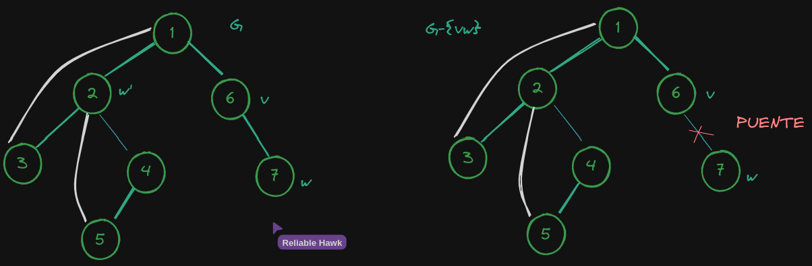

*Una arista de un grafo G es **puente** si su remoción aumenta la cantidad de componentes conexas
de G.*

---

*Sea T un árbol DFS de un grafo conexo G.*

---

*a) Demostrar que vw es un puente de G si y solo si vw no pertenece a ningún ciclo de G.*

---

vw es un puente de G $\Leftrightarrow$ vw no pertenece a ningún ciclo de G
---

$\Rightarrow$)\
Suponemos que vale que vw es puente de G.\
Queremos ver que entonces vw no pertenece a ningún ciclo de G.

Podemos probarlo usando reducción al absurdo.\
Supongamos que vw pertenece a un ciclo de G.\
Entonces, si removemos vw, el grafo G sigue siendo conexo.\
Esto es una contradicción con la definición de puente.\
Por lo tanto, vw no pertenece a ningún ciclo de G.

$\Leftarrow$)\
Suponemos que vale que vw no pertenece a ningún ciclo de G.\
Queremos ver que entonces vw es puente de G.

Podemos probarlo usando reducción al absurdo.\
Supongamos que vw no es puente de G.\
Entonces, si removemos vw, el grafo G sigue siendo conexo.\
Esto es una contradicción con la definición de que vw no pertenece a ningún ciclo de G.\
Por lo tanto, vw es puente de G.

$\blacksquare$

---
*b) Demostrar que si vw ∈ E(G) \ E(T), entonces v es un ancestro de w en T o viceversa (w es un ancestro de v).*
---

Vamos a demostrarlo por **contradicción**.

Cuando construimos un árbol DFS, visitamos cada vértice y cada arista exactamente una vez.\
Cuando llegamos a un vértice 𝑣, exploramos todas las aristas que parten de 𝑣 y visitamos los vértices alcanzables desde 𝑣.\
Si encontramos un vértice que ya ha sido visitado, retrocedemos por la arista que nos llevó a ese vértice.

---
Supongamos que `𝑣 no es un ancestro de 𝑤 ni 𝑤 es un ancestro de 𝑣 en el árbol 𝑇`.\
Esto significa que `𝑣 y 𝑤 pertenecen a diferentes subárboles en 𝑇`.\
Además, como 𝑣𝑤 ∈ 𝐸(𝐺) \ 𝐸(𝑇), la arista `𝑣𝑤 no fue utilizada para construir el árbol DFS (𝑇)`.

Como 𝑣 y 𝑤 pertenecen a diferentes subárboles en 𝑇, `no existe un camino directo entre 𝑣 y 𝑤 en 𝑇`.\
Pero como `𝐺 es conexo`, debe haber un camino entre 𝑣 y 𝑤 en 𝐺, y este camino no puede pasar por el árbol DFS (𝑇) ya que 𝑣𝑤 ∈ 𝐸(𝐺) \ 𝐸(𝑇).\
Esto significa que debe haber una arista en el camino de 
𝑣 a 𝑤 que no está en 𝑇.\
Sea `𝑢` el vértice donde esta arista se encuentra en el camino de 𝑣 a 𝑤.

Como 𝑇 es un árbol DFS, `𝑢 es un ancestro de 𝑣 o 𝑤 en 𝑇` (puede ser 𝑣 o 𝑤 mismo).\
Pero esto `contradice` nuestra suposición de que 𝑣 y 𝑤 pertenecen a diferentes subárboles en 𝑇, ya que 𝑢 sería un ancestro común de 𝑣 y 𝑤.

Por lo tanto, nuestra suposición inicial de que 𝑣 no es un ancestro de 𝑤 ni 𝑤 es un ancestro de 𝑣 en 𝑇 o viceversa es incorrecta, lo que implica que `si 𝑣𝑤 ∈ 𝐸(𝐺) \ 𝐸(𝑇), entonces 𝑣 es un ancestro de 𝑤 en 𝑇 o viceversa`.

$\blacksquare$

---

*c) Sea `vw ∈ E(G)` una arista tal que `el nivel de v en T` es menor o igual al `nivel de w en T`.\
Demostrar que vw es puente si y solo si v es el padre de w en T y ninguna arista de G \ {vw}
une a un descendiente de w (o a w) con un ancestro de v (o con v).*

vw es puente de G $\Leftrightarrow$ v es padre de w en T y ninguna arista de G \ {vw} une a un descendiente de w (o a w) con un ancestro de v (o con v)
---

$\Rightarrow$)
---

Suponemos que `vw es puente de G`.\
Queremos ver que v es padre de w en T y ninguna arista de `G \ {vw}` une a un descendiente de w (o a w) con un ancestro de v (o con v).

Como `vw es puente de G`, tenemos un único camino entre v y w en G.\
Entonces v es padre de w en T.

Además, si removemos `vw` `(G \ {vw})`, el grafo G deja de ser conexo (porque vw es puente).\
Entonces ahora v y w pertenecen a diferentes componentes conexas.\
Esto significa que `no hay un camino` entre `v` y `w` en `G \ {vw}`.\
Por lo tanto, ninguna arista de `G \ {vw}` une a un descendiente de w (o a w) con un ancestro de v (o con v).

Los descendientes de w son los vértices a los que puedo llegar a partir de w.\
Los ancestros de v son los vértices a los que puedo llegar a partir de v.\
Por lo tanto, ninguna arista de `G \ {vw}` une a un descendiente de w (o a w) con un ancestro de v (o con v).

$\Leftarrow$)
---

Suponemos que `v es padre de w en T y ninguna arista de G \ {vw} une a un descendiente de w (o a w) con un ancestro de v (o con v)`.\
Queremos ver que `vw es puente de G`.

Como `v es padre de w en T`, la arista `vw` es parte del árbol DFS `T`.

Además, `ninguna arista de G\{vw} une a un descendiente de w (o a w) con un ancestro de v (o con v) en T`.

Es decir, no hay un camino entre `v` y `w` que no pase por `vw`.

Si removemos `vw` de `G`, el grafo `G` deja de ser conexo.\
Esto es porque no hay un camino entre `v` y `w` que no pase por `vw`.\
Por lo tanto, `vw` es puente de `G`.

$\blacksquare$

---

*d) Dar un algoritmo lineal basado en DFS para encontrar todas las aristas puente de G.*
---
*<u>Ayuda</u>: el algoritmo puede hacer un uso inteligente de un único DFS.\
Conceptualmente, y a los efectos de este ejercicio, puede convenir separar el algoritmo en dos fases.*
1. *La primera fase aplica DFS para calcular el **mínimo nivel** que se puede alcanzar desde cada vértice usando **back edges** que estén en su subárbol.*
2. *La segunda fase recorre todas las aristas (sin DFS) para chequear la condición.*

---

**Back edge**: It is an edge (u, v) such that v is the ancestor of node u but is not part of the DFS tree.

---

