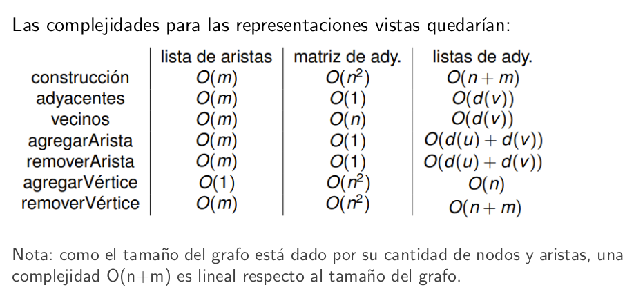
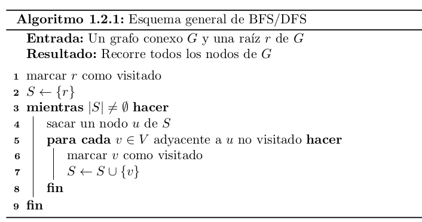
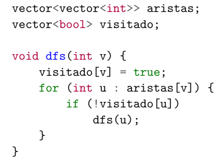
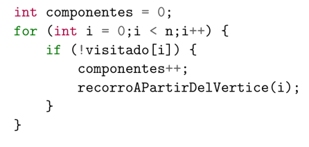
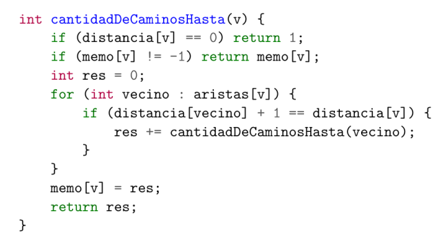
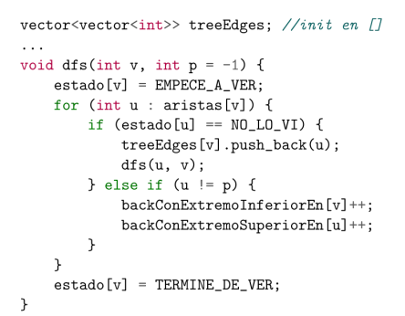
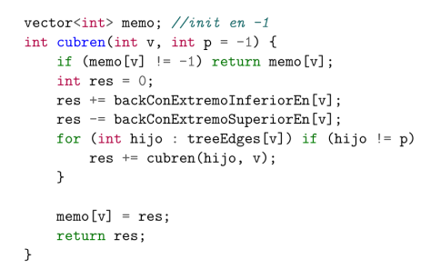
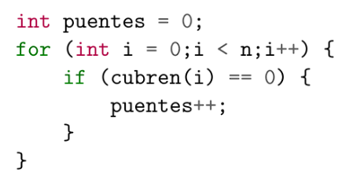

<u>Fuerza Bruta / Búsqueda exhaustiva</u>

* Para problemas de búsqueda en un conjunto S.
* Queremos hacer algo con los elementos que cumpla una cierta propiedad P.
* La idea más simple: recorremos todo S evaluando P en cada elemento.
* La complejidad en general será Ω(|S|).

Backtracking
---

*(Búsqueda exhaustiva + Podas)*

Dado un problema $\pi$, se puede resolver haciendo una $\color{lightgreen}\text{búsqueda exhaustiva}$ entre sus $\color{lightgreen}\text{soluciones candidatas}$.

La técnica de $\color{lightgreen}\text{backtracking}$ hace una exploración ordenada de este espacio de soluciones por medio de la extensión de $\color{lightgreen}\text{soluciones parciales}$. 

Cada posible extensión de una solución parcial es explorada haciendo $\color{lightgreen}\text{recursión}$ sobre la nueva solución extendida.

Podemos representar visualmente esta exploración como el recorrido en profundidad de un $\color{lightgreen}\text{árbol}$.

Frecuentemente es posible aplicar $\color{lightgreen}\text{podas}$ al árbol para reducir el espacio de búsqueda.

Podemos pensar una solución candidata como una tupla $(x_1, x_2, \ldots, x_k)$, donde $x_i$ es una desición de entre un conjunto $S_i$ de alternativas.

Pensamos la recursión como el problema donde alguna de estas desiciones ya vienen tomadas.

---
---

**Recursión**\
Las recursividad es una técnica que nos permite resolver el problema al reducirlo a operaciones más sencillas que emplean la solución de versiones más pequeñas del mismo.
* “Si es caso chiquito es fácil resolverlo” (Caso base)
* “Si tuviera resueltas estas partes, podría usarlas para resolver mi caso actual” (Caso
recursivo)

En backtracking usamos la recursión como un mecanismo para generar todo el espacio de soluciones.\
En muchos casos podremos saber si las soluciones que generamos no serán factibles u óptimas y evitando resolver el problema para algunas de las instancias recursivas (podas de factibilidad ú optimalidad).

Programación Dinámica
---

*(Búsqueda exhaustiva + solapamiento de subproblemas)*

$\color{lightgreen}\text{Top-Down}$

**Idea**: Si llamo a una función $\color{lightgreen}\text{más de una vez}$ con los mismos parámetros, me conviene computarla una sola vez y guardarme el resultado.

<u>Superposición de problemas</u>\
Decimos que tenemos $\color{lightgreen}\text{superposición de problemas}$ si la cantidad de llamadas recursivas de la función sin memorizar es *mucho mayor* que la cantidad de estados posibles.

$$\Omega(cant(llamadasRecursivas)) >> O(cant(estados))$$

Entonces sabemos que vale la pena aplicar programación dinámica.

Nos interesarı́a resolver todos los subproblemas ya calculados en O(1).\
¿Cómo podemos hacerlo?\
Con una estructura de $\color{lightgreen}\text{memorización}$.\
Vamos a guardar todos los valores ya calculados en una estructura y leerlos cuando los volvamos a necesitar.

¿Pagamos algo por esta mejora en complejidad temporal?\
Estamos guardando más información en la memoria.\
Es decir, aumentó nuestra complejidad espacial.

<u>Pasos para evaluar superposición de subproblemas</u>

$\color{lightgreen}\text{Paso 1. Llamados recursivos}$\
¿cuántos llamados recursivos hace nuestra funciíon en peor caso?
$\color{lightgreen}\text{Paso 2. Cantidad de subproblemas a resolver}$\
¿cuántos subproblemas distintos tiene el problema? (¿cuántos estados distintos tiene el problema?)
Esto depende de la cantidad de parámetros que tenga la función y los posibles valores que puedan tomar.\
$\color{lightgreen}\text{Paso 3. Comparar las cotas}$
Si la cantidad de llamados recursivos es mucho mayor que la cantidad de subproblemas distintos, entonces vale la pena aplicar programación dinámica.

¿Qué estructura de memorización podemos usar para guardar los subproblemas ya resueltos?\
La solución suele ser una $\color{lightgreen}\text{matriz}$ con una dimensión para cada parámetro de entrada.

---
---

**Top-down**: Ir de lo **más general** a lo **más específico**.\
**Bottom-up**: Ir de lo **más específico** a lo **más general**.

Diferencias:

**Top-down**
* Recursivo en general
* A veces más fácil de programar (agarrás el backtracking, le agregás memorización y listo)

**Bottom-up**
* Iterativo en general
* A veces usa menos memoria
* A veces es más rápido en la práctica (recursión vs. iteración).

$\color{lightgreen}\text{Bottom-Up}$

En lugar de usar recursión usamos iteración.\
Iterativamente resolvemos todos los subproblemas, guardando los resultados en la estructura de memoización.\
En qué orden?

¿Cómo se piensan estos problemas?
* Identificar casos borde.
* Definir una función de recurrencia f.
* Demostrar que efectivamente f resuelve el problema.
* Implementarla y deducir la complejidad.

---
---

Dividir y conquistar
---
*(Partir subproblemas hasta que son resolubles de una manera más simple)*

* Dividir un problema en subproblemas del mismo tipo que el original.
* Resolver los problemas más pequeños.
* Combinar las soluciones.

* Las subpartes tienen que ser más pequeñas.
* Y ser el mismo tipo de tarea.
* Dividir y combinar pueden no ser nulas, pero no tienen que ser demasiado costosas.

**F(X)**
* Si X es suficientemente chico o simple, solucionar de manera ad hoc.
* Si no,
    * Dividir a X en $X_1 , X_2 , . . ., X_k$
    * $\forall i \leq k$, hacer $Y_i = F(X_i)$
    * Combinar los $Y_i$ en un Y que es una solución para X.
    * Devolver Y

$\color{lightgreen}\text{Teorema Maestro}$

Permite resolver relaciones de recurrencia de la forma:

$$ T(n) =  \begin{cases} aT(\frac{n}{c}) + f(n) & \text{si } n > 1 \\ 1 & \text{si } n = 1 \end{cases}$$

Si $f(n) = O(n^{\log_c a - \epsilon})$ para algún $\epsilon > 0$, entonces $T(n) = \Theta(n^{\log_c a})$.

Si $f(n) = \Theta(n^{\log_c a})$, entonces $T(n) = \Theta(n^{\log_c a} \log n)$.

Si $f(n) = \Omega(n^{\log_c a + \epsilon})$ para algún $\epsilon > 0$, y si $a f(\frac{n}{c}) < k f(n)$ para algún $k < 1$ y $n$ suficientemente grande, entonces $T(n) = \Theta(f(n))$. 

---
---

Algoritmos Greedy
---

*(Heurı́stica con la mejor opción local)*

Venimos viendo problemas cuyas soluciones se construyen tomando desiciones una a una.\
En cada elección, potencialmente hay una opción que localmente es la más atractiva.\
Es como tomar el árbol de backtracking y, en vez de comparar las ramas, elegir una según algún criterio.\
Frecuentemente, implica ordenar los elementos del input de alguna manera específica.

El algoritmo greedy para un problema dado nos proveerá una $\color{lightgreen}\text{solución candidata}$.\
La pregunta es si esa solución es $\color{lightgreen}\text{correcta}$ (por ejemplo, si es óptima).\
Es común que los algoritmos greedy no sean complejos de implementar y la dificultad esté en probar que son correctos.

En general hay dos formas de ver que un algoritmo goloso es óptimo:
* Demostrar que nuestro algoritmo siempre se mantiene ”adelante” de cualquier otra solución óptima $\color{lightgreen}\text{(Greedy stays ahead)}$.
* Mostrar que podemos agarrar una solución óptima y modificarla sin incrementar su costo y llevarla a la de nuestro algoritmo goloso $\color{lightgreen}\text{(Exchange argument)}$.

---
---

Grafos
---

Un $\color{lightgreen}\text{grafo}$ es un par (V, E) con V un conjunto de nodos (o vértices) y E un conjunto de aristas (o ejes) de la forma (u, v) con u, v ∈ V.

$\color{lightgreen}\text{Digrafo}$\
Es un grafo, es decir, un par (V, E) como antes, pero cuyas aristas están orientadas. Es decir que en este caso (u, v) $\neq$ (v, u).

Llamamos **multigrafo** a un grafo que permite tener múltiples aristas entre dos nodos.\
Llamamos **pseudografo** a grafos que permiten tener loops.\
Llamamos a un grafo **pesado** cuando G=(V, E, w) con w(e) una ”función de pesos” que asigna a cada arista e=(u,v) un peso. (Observacion: se puede usar para simplificar multigrafos).\
**Recorrido**: una sucesión de vértices y aristas del grafo.\
**Camino**: un recorrido que no pasa dos veces por el mismo vértice.\
**Circuito**: un recorrido que empieza y termina en el mismo nodo.\
**Ciclo o circuito simple**: un circuito que no repite vértices.\
(Nota: para grafos, no consideramos como válido al ciclo de longitud 2).\
**Longitud**: la longitud de un recorrido se nota l(P) y es la cantidad de aristas del mismo.\
**Distancia entre dos vértices**: longitud del camino más corto entre los vértices (si no existe se dice ∞).\
Un nodo es **adyacente** a otro si están conectados.\
Una arista es **incidente** a un nodo si conecta dicho nodo con algún otro.

En general vamos a denotar con $\color{lightgreen}\text{n}$ la cantidad de nodos que tiene al grafo, y con $\color{lightgreen}\text{m}$ a la cantidad de aristas.

$\color{lightgreen}\text{Para grafos:}$\
N(v): vecindario del vértice v (conjunto de nodos adyacentes a v).\
N[v]: vecindario cerrado de v, N[v] = N(v) ∪ v.\
d(v): el grado de v (cantidad de vecinos), d(v) = |N(v)|.

$\color{lightgreen}\text{Para digrafos:}$\
$N^{in}(v)$ y $N^{out}(v)$ son los vecindarios de entrada y salida respectivamente.\
$d^{in}(v)$ y $d^{out}(v)$ son los grados de entrada y salida respectivamente.

Por conveniencia, vamos a suponer que todos los nodos del grafo son números de [1, n].\
Podrı́amos $\color{lightgreen}\text{representar}$ el grafo de dos maneras:\
**Conjunto de aristas**: guardamos el conjunto E del grafo.\
**Diccionario**: le asociamos a cada vértice ’v’ su vecindario N(v).

Principalmente vamos a utilizar las siguientes estructuras de representación:\
* Lista de aristas\
El conjunto de aristas como una secuencia (lista).
* $\color{lightgreen}\text{Lista de adyacencia}$\
El diccionario es un vector y los vecindarios son listas de tamaño d(v) conteniendo a los nodos vecinos.
* Matriz de adyacencia\
El diccionario y los vecindarios son vectores de tamaño n. Resultando ası́ en una matriz de nxn donde $M_{ij}$ = 1 si los vértices i y j son adyacentes y $M_{ij}$ = 0 si no.

* La complejidad de pedir los vecinos queda en O(d(v)) porque, si bien podrı́amos devolver el puntero al inicio de la lista en O(1), eso rompe el encapsulamiento.\
Serı́a mejor devolver una copia del vecindario para garantizar que no se rompa la estructura externamente.
* Si bien decimos que la complejidad de agregar vértices de una lista de adyacencia es O(n) por el costo de reinicializar el array, si se usaran arrays dinámicos quedarı́a en O(1) amortizado.

**Representación de árboles**
---

$\color{lightgreen}\text{Árbol}$
Un árbol es un grafo conexo, acı́clico y con n-1 aristas.\
Nota: alcanza con saber que cumple con dos de dichas propiedades para afirmar que un grafo es un árbol.

Podemos tener una función padre tal que padre[v] es el (único) padre de v para todo v que no es la raı́z. Para la raı́z r podrı́amos poner padre[r] = r.

Demostraciones\
Hay distintas maneras de demostrar que una afirmación es correcta.\
Algunas opciones que tenemos son las siguientes:
* Por inducción.
* Por absurdo.
* Constructivamente (p → q).
* Por contrarecı́proco (¬q → ¬p).

Las demos se pueden dividir en casos, y probar cada uno como sea conveniente.

$\color{lightgreen}\text{Inducción en grafos}$\
En grafos muchas veces vamos a tener que hacer inducción en la cantidad de nodos o aristas de un grafo.\
Tengan en cuenta que:
**NUNCA**: tomo un grafo $G_k$ de k vértices (o k aristas) y digo que si una propiedad P se prueba para este grafo, agregándole un v vértice (o arista) sigue valiendo P para $G_{k+1}$.
**SIEMPRE**: tomo un grafo $G_{k+1}$ de k + 1 vértices (o k + 1 aristas) con ciertas caracterı́sticas y le saco un vértice (o arista) con algún tipo de estrategia particular y veo que cumple P. Luego, agrego el
vértice o arista y veo que sigue cumpliendo P.

Si G es un grafo de n nodos y tiene al menos n ejes, entonces tiene un ciclo. (ejercicio visto en clase)

---

$\color{lightgreen}\text{DFS}$ es un algoritmo recursivo que sigue la idea de backtracking para poder recorrer todos los nodos. Lo podemos usar tanto para grafos dirigidos como para no dirigidos.\
Vamos a recorrer en profundidad (**Depth**): siempre vamos hasta el final de la rama y de ahi subimos.

La complejidad de DFS es $\color{lightgreen}\text{O(m+n)}$ ya que recorro todos los nodos una sola vez y reviso las aristas también una sola vez (aunque puede que no
recorra todas).\
Sin agregarle complejidad al algoritmo de DFS podemos pedirle que nos devuelva el arbol o bosque (como un vector de padres) y la lista de $\color{lightgreen}\text{backedges}$, que son las aristas que generan ciclos.

Con $\color{lightgreen}\text{BFS}$ también vamos a recorrer todos los nodos pero en lugar de recorrer en profundidad va recorriendo a lo ancho. Se suele implementar iterativo. La idea del algoritmo es arrancar en algún nodo y recorrer todos sus vecinos, luego los vecinos de sus vecinos...

La complejidad de BFS también es $\color{lightgreen}\text{O(m+n)}$, al igual que DFS.\
Nos devuelve un árbol v-geodésico, siendo v el nodo desde el cual corremos el algoritmo. Puede devolver también las distancias de v a todos en el grafo (que son iguales que el árbol ya que es v-geodésico!!)

¿Cómo podemos ver que un grafo es conexo?\
Podrı́amos correr alguno de los algoritmos de recorrido y ver si todos los nodos fueron visitados (usando el vector visitados).

Dar un algoritmo que dado un grafo devuelva la cantidad de componentes conexas que tiene.

Podrı́amos resolverlo con la implementación usual de DFS o BFS
agregando un contador de componentes conexas.

Queremos calcular la cantidad de caminos con mı́nima cantidad de aristas entre nuestro vértice inicial v y el vértice w. Cómo podemos
hacer? Usando BFS...

Vamos a resolverlo usando programación dinámica.
* Sabemos que BFS nos da un vector con las distancias de v a todos, ası́ que comenzamos corriendo un BFS.
* Luego usando el vector de distancias hacemos un algoritmo que de abajo hacia arriba en el árbol chequee si para algún otro vecino de v distancia[w] = distancia[adyacente a w] + 1
* Si pasa eso debo volver a correr el algoritmo desde el adyacente de w, ya que podria haber más de una manera de llegar a ese con distancia mı́nima también
* Lo hacemos con programación dinámica ya que tenemos superposición de problemas.

Dar un algoritmo lineal basado en DFS para encontrar todas las aristas puente de G (2d de la guia).

* Una arista es puente si al sacarla aumenta la cantidad de componentes conexas
* Una back-edge nunca puede ser puente
* Las aristas que son puentes son aquellas tree-edges que no tienen una
back-edge que las ”cubra”

La cantidad de backedges que cubren la arista entre v y su padre se puede calcular de la siguiente manera:\
cubren(v) =backEdgesConExtremoInferiorEn(v ) −
backEdgesConExtremoSuperiorEn(v ) + $\sum_{w\in hijos(v)} {cubren(w)}$

En este DFS si ya pasé por un nodo
y no es el padre entonces sumo una
backedge.

OJO nos falta restar la cantidad de componentes ya que como vimos en
los ejemplos la raiz de los árboles también tiene cubren = 0.

puentes -= componentesConexas

Orden topológico\
Dado un digrafo D, un orden topológico de D es un ordenamiento $v_1 . . .v_n$ de sus nodos que cumple que todo eje queda de la forma $v_i v_j$ con i < j (en el ordenamiento). Es decir, damos un orden a los nodos de tal forma que las aristas apuntan de izquierda a derecha (“no hay aristas para atrás”).

$\color{lightgreen}\text{}$